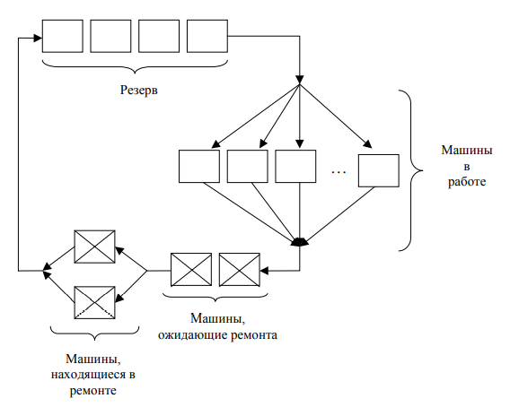

**Вариант 1**

На трикотажной фабрике 50 швейных машин работают по 8 часов в день и по 5 дней в неделю. Любая из этих машин может в любой момент времени выйти з строя. В этом случае её заменяют разервной машиной (либо сразу, либо по мере её появления). Вышедшую из строя машину отправляют в ремнтную мастерскую, где её чинят и возвращают в цех, но уже в кчестве резервной.

В существующем замкнутом цикле движения машин легко можно выделить четыре фазы:

Управляющий хочет знать:
1. сколько механиков нужно взять для ремнота машин
2. сколько машин иметь в резерве и какую платить за них арендную плату.

Цель - минимизация расходов производства.

Оплата рабочих-механиков - 3,75 руб/час.

За резервные машины платят 30 руб/день.

Почасовой убыток при использовании менее 50 машин в производстве оценивается в 20 руб за машину. Этот убыток возникает в результате снижения производства.

На ремонт уходит (7±3) часа.

Время наработки машины до отказа - (157±25) часов.

Плата за аренду не зависит работают машины или нет.

Постройте модель работы мастерской за 3 года (в году 52 недели).